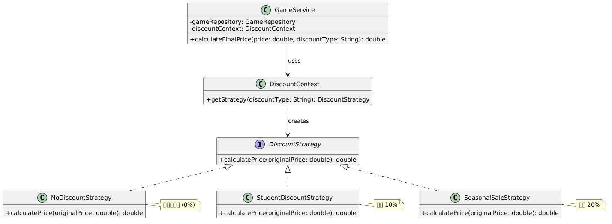
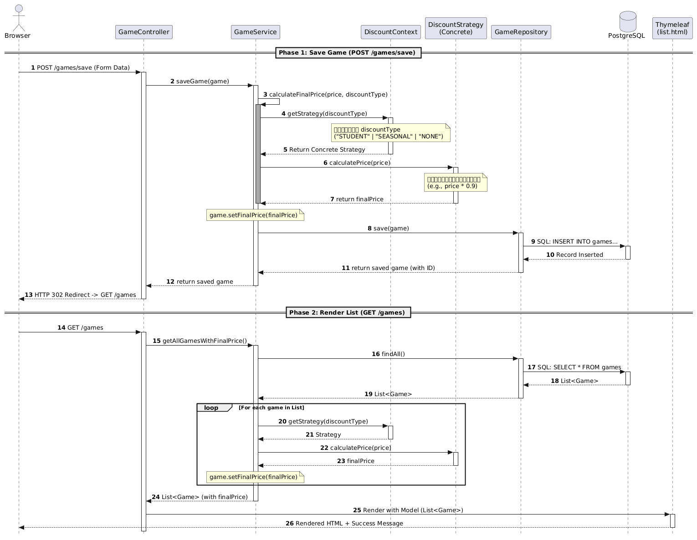

# รายงาน Lab 7: Database Connectivity — Game Catalog CRUD

**ชื่อ-นามสกุล:** เพชรภิญโญ ธนศิรินรากร  
**รหัสนักศึกษา:** 673380073-7  
**Section:** 2  
**วิชา:** CP353002 Principles of Software Design  
**หัวข้อ:** การเชื่อมต่อฐานข้อมูลด้วย Spring Boot + JPA + JDBC + PostgreSQL
**Document** 

---

# ส่วนที่ 1: Software Design & Principles Explanation

## 🧠 1.1 สถาปัตยกรรมและ GRASP Patterns

### Layered Architecture

โปรเจคนี้ใช้สถาปัตยกรรมแบบ **Layered Architecture** แบ่งเป็น 4 ชั้นหลัก:

```
┌─────────────────────────────────────┐
│   Presentation Layer (Controller)   │  ← รับ HTTP Request, ส่งข้อมูลไปยัง View
├─────────────────────────────────────┤
│   Business Logic Layer (Service)    │  ← ประมวลผล Business Logic, Strategy Pattern
├─────────────────────────────────────┤
│   Data Access Layer (Repository)    │  ← CRUD กับฐานข้อมูล
├─────────────────────────────────────┤
│   Database Layer (PostgreSQL)       │  ← จัดเก็บข้อมูล
└─────────────────────────────────────┘
```

### การประยุกต์ใช้ GRASP Patterns

#### 1. Controller Pattern

**คลาส:** `GameController`

**หน้าที่:** เป็นตัวกลางระหว่าง User Interface (Thymeleaf Templates) กับ Business Logic (GameService)

**อธิบาย:** `GameController` ทำหน้าที่รับ HTTP Request จาก Browser เมื่อผู้ใช้คลิกปุ่มหรือส่งฟอร์ม จากนั้นเรียก method ใน `GameService` เพื่อประมวลผลตาม Business Logic และส่งผลลัพธ์กลับไปแสดงผลที่ View (Thymeleaf) โดย Controller ไม่ควรมี Business Logic หรือเข้าถึง Database โดยตรง

**ประโยชน์:** แยก UI logic ออกจาก business logic ทำให้ระบบมี **Low Coupling** หากต้องการเปลี่ยน UI Framework (เช่นจาก Thymeleaf เป็น React) ไม่กระทบ Business Logic

---

#### 2. Information Expert

**คลาส:** `GameService`

**หน้าที่:** มีข้อมูลและความรู้ในการคำนวณราคาเกม (เรียกใช้ DiscountContext)

**อธิบาย:** ตามหลัก Information Expert ความรับผิดชอบควรอยู่ที่คลาสที่มีข้อมูลครบถ้วนที่สุด `GameService` มีข้อมูลเกม (Game) และมีความรู้ว่าต้องคำนวณราคาอย่างไร จึงเหมาะสมที่จะให้ `GameService` เป็นผู้จัดการ Business Logic ทั้งหมด รวมถึงการเรียกใช้ `DiscountContext` เพื่อคำนวณราคาสุทธิ

**ประโยชน์:** วาง responsibility ไว้ที่คลาสที่มีข้อมูลครบถ้วนที่สุด ทำให้ Logic อยู่ในที่ที่ถูกต้อง

---

#### 3. Low Coupling

**อธิบาย:**

- **Controller** ไม่รู้จัก Repository โดยตรง → เรียกผ่าน Service
- **Service** ไม่รู้จัก Concrete Strategy classes → เรียกผ่าน Interface (DiscountStrategy)

**ตัวอย่าง:**

- `GameController` → เรียก `GameService` (ไม่เรียก `GameRepository` โดยตรง)
- `GameService` → เรียก `DiscountContext.getStrategy()` (ไม่เรียก `new StudentDiscountStrategy()` โดยตรง)

**ประโยชน์:** แก้ไขส่วนหนึ่งไม่กระทบส่วนอื่น เช่น หากเปลี่ยนวิธีคำนวณส่วนลด แก้เฉพาะ Strategy class ไม่กระทบ Service หรือ Controller

---

#### 4. High Cohesion

**อธิบาย:** แต่ละคลาสมีหน้าที่ชัดเจน เฉพาะเจาะจง และไม่ทำงานที่ไม่เกี่ยวข้อง

**ตัวอย่าง:**

- `GameController` → จัดการ HTTP Request/Response เท่านั้น
- `GameService` → ประมวลผล Business Logic เท่านั้น
- `GameRepository` → CRUD Database เท่านั้น
- Strategy classes → คำนวณราคาเท่านั้น

**ประโยชน์:** เข้าใจง่าย บำรุงรักษาง่าย แก้ไขง่าย เพราะแต่ละคลาสมีหน้าที่เฉพาะเจาะจง

---

#### 5. Indirection

**คลาส:** `DiscountContext`

**หน้าที่:** เป็นตัวกลางในการเลือก Strategy ที่เหมาะสม

**อธิบาย:** แทนที่จะให้ `GameService` เลือก Strategy โดยตรง (เช่น `if-else` หรือ `switch-case` ใน Service) เราสร้าง `DiscountContext` เป็นตัวกลาง ทำให้ `GameService` ไม่ต้องรู้ว่ามี Strategy อะไรบ้าง เพียงแค่เรียก `discountContext.getStrategy(discountType)` แล้วรับ Strategy กลับมา

**ประโยชน์:** `GameService` ไม่ต้องรู้ว่ามี Strategy อะไรบ้าง หากเพิ่ม Strategy ใหม่ แก้เฉพาะ `DiscountContext` ไม่กระทบ `GameService`

---

## 🎯 1.2 High-Level SOLID Principles

### 1. Single Responsibility Principle (SRP)

**หลักการ:** คลาสหนึ่งควรมีเหตุผลเดียวในการเปลี่ยนแปลง

**การประยุกต์ใช้:**

- **GameController** → รับผิดชอบเฉพาะการจัดการ HTTP Request/Response (เช่น รับข้อมูลจากฟอร์ม ส่ง Model ไปยัง View)
- **GameService** → รับผิดชอบเฉพาะ Business Logic (เช่น คำนวณราคาสุทธิ บันทึกเกม)
- **GameRepository** → รับผิดชอบเฉพาะการเข้าถึงฐานข้อมูล (CRUD)
- **DiscountStrategy (implementations)** → รับผิดชอบเฉพาะการคำนวณราคาแบบหนึ่งๆ

**ตัวอย่าง:**

หากต้องการเปลี่ยนวิธีคำนวณส่วนลดนักศึกษาจาก 10% เป็น 15% เราแก้เฉพาะ `StudentDiscountStrategy.java`:

```java
// แก้ไขเฉพาะไฟล์นี้
public class StudentDiscountStrategy implements DiscountStrategy {
    @Override
    public double calculatePrice(double originalPrice) {
        return originalPrice * 0.85; // เปลี่ยนจาก 0.9 เป็น 0.85
    }
}
```

ไม่ต้องแก้ไข `GameService`, `GameController`, หรือ Strategy classes อื่นๆ

**ประโยชน์:** แก้ไขส่วนเดียว ไม่กระทบส่วนอื่น ลด Risk ที่จะทำให้โค้ดเดิมเสีย

---

### 2. Open/Closed Principle (OCP)

**หลักการ:** เปิดรับการขยาย (Open for Extension) แต่ปิดการแก้ไข (Closed for Modification)

**การประยุกต์ใช้:**

หากต้องการเพิ่มส่วนลดรูปแบบใหม่ เช่น **VIP Discount 30%** เราไม่ต้องแก้โค้ดเดิมใน `GameService` แค่:

1. สร้างคลาสใหม่ `VipDiscountStrategy.java`
2. แก้ไข `DiscountContext.java` เพิ่ม case `"VIP"`

**ตัวอย่าง:**

```java
// ไฟล์ใหม่: VipDiscountStrategy.java
public class VipDiscountStrategy implements DiscountStrategy {
    @Override
    public double calculatePrice(double originalPrice) {
        return originalPrice * 0.7; // ลด 30%
    }
}

// แก้ไข: DiscountContext.java (เพิ่มเฉพาะ 1 บรรทัด)
return switch (discountType.toUpperCase()) {
    case "STUDENT" -> new StudentDiscountStrategy();
    case "SEASONAL" -> new SeasonalSaleStrategy();
    case "VIP" -> new VipDiscountStrategy();  // ← เพิ่มบรรทัดนี้
    default -> new NoDiscountStrategy();
};
```

**ไม่ต้องแก้ไข:**

- ❌ `GameService.java`
- ❌ `GameController.java`
- ❌ `NoDiscountStrategy.java`, `StudentDiscountStrategy.java`, `SeasonalSaleStrategy.java`

**ประโยชน์:** ขยายระบบได้โดยไม่เสี่ยงทำให้โค้ดเดิมเสีย (Closed for Modification) แต่เปิดรับการขยายได้ (Open for Extension)

---

### 3. Liskov Substitution Principle (LSP)

**หลักการ:** Subclass ต้องสามารถแทนที่ Superclass ได้โดยไม่ทำให้ระบบพัง

**การประยุกต์ใช้:**

ทุกคลาสที่ implement `DiscountStrategy` สามารถใช้แทนกันได้อย่างสมบูรณ์

**ตัวอย่าง:**

```java
// ทุก Strategy สามารถแทนที่กันได้
DiscountStrategy strategy;

strategy = new NoDiscountStrategy();
double price1 = strategy.calculatePrice(9999.0); // 9999.0

strategy = new StudentDiscountStrategy();
double price2 = strategy.calculatePrice(9999.0); // 8999.1

strategy = new SeasonalSaleStrategy();
double price3 = strategy.calculatePrice(9999.0); // 7999.2
```

**อธิบาย:** ไม่ว่าจะใช้ Strategy ไหน การเรียก `calculatePrice()` ทำงานได้เหมือนกัน ไม่มี Strategy ไหนที่ทำให้ระบบพัง

**ประโยชน์:** ระบบยืดหยุ่น สลับ Strategy ได้ runtime โดยไม่ต้องกังวลว่าจะทำให้ระบบเสีย

---

### 4. Interface Segregation Principle (ISP)

**หลักการ:** ไม่ควรบังคับให้ implement method ที่ไม่ใช้

**การประยุกต์ใช้:**

`DiscountStrategy` มีเฉพาะ method เดียว `calculatePrice()` ที่จำเป็น

```java
public interface DiscountStrategy {
    double calculatePrice(double originalPrice); // ← เพียง method เดียว
}
```

**ไม่มี method ที่ไม่จำเป็น เช่น:**

- ❌ `getDiscountName()` (ไม่ได้ใช้ในระบบ)
- ❌ `getDiscountPercentage()` (ไม่ได้ใช้ในระบบ)
- ❌ `isApplicable()` (ไม่ได้ใช้ในระบบ)

**อธิบาย:** หาก Interface มี method มากเกินไป คลาสที่ implement ต้อง implement method ที่ไม่ใช้ด้วย ทำให้โค้ดซับซ้อนและยากต่อการบำรุงรักษา

**ประโยชน์:** Interface กะทัดรัด implement ง่าย ไม่มี method ที่ไม่จำเป็น

---

### 5. Dependency Inversion Principle (DIP)

**หลักการ:** High-level modules ไม่ควรพึ่งพา Low-level modules ควรพึ่งพา Abstraction

**การประยุกต์ใช้:**

`GameService` พึ่งพา Abstraction (`GameRepository` Interface, `DiscountContext`) ผ่าน **Constructor Injection**

```java
@Service
public class GameService {
    private final GameRepository gameRepository;      // ← Interface (Abstraction)
    private final DiscountContext discountContext;    // ← Abstraction

    // Constructor Injection
    public GameService(GameRepository gameRepository,
                       DiscountContext discountContext) {
        this.gameRepository = gameRepository;
        this.discountContext = discountContext;
    }
}
```

**อธิบาย:**

- `GameService` ไม่รู้ว่า `GameRepository` เป็น JPA Repository หรือ JDBC Repository
- `GameService` ไม่รู้ว่า `DiscountContext` สร้าง Strategy อย่างไร
- Spring จัดการ dependency อัตโนมัติ (Dependency Injection)

**ประโยชน์:**

- ง่ายต่อการเขียน Unit Test (สามารถ Mock `GameRepository` และ `DiscountContext` ได้)
- แก้ไข implementation ได้โดยไม่กระทบ `GameService`
- ระบบยืดหยุ่น เปลี่ยน Repository จาก JPA เป็น JDBC ได้โดยไม่แก้ `GameService`

---

## 🧩 1.3 Strategy Pattern

### คำอธิบาย Strategy Pattern

**Strategy Pattern** เป็น Behavioral Design Pattern ที่ใช้ในการกำหนด algorithm หลายแบบ แล้วสลับใช้ได้ runtime โดยไม่ต้องแก้โค้ดที่เรียกใช้

**โครงสร้าง:**

- **Interface:** `DiscountStrategy` กำหนด method `calculatePrice()`
- **Concrete Strategies:** คลาสที่ implement `DiscountStrategy` แต่ละคลาสคำนวณราคาต่างกัน
- **Context:** `DiscountContext` เลือก Strategy ที่เหมาะสม
- **Client:** `GameService` เรียกใช้ผ่าน Context

### โครงสร้างของ Strategy Pattern ในระบบ



### การประยุกต์ใช้ในโปรเจค

**1. Interface: DiscountStrategy**

กำหนด method `calculatePrice()` ที่ทุก Strategy ต้อง implement

**2. Concrete Strategies:**

- `NoDiscountStrategy` → คืนราคาเต็ม (ไม่ลด)
- `StudentDiscountStrategy` → ลด 10%
- `SeasonalSaleStrategy` → ลด 20%

**3. Context: DiscountContext**

ทำหน้าที่เลือก Strategy ที่เหมาะสมตาม `discountType`:

- `"STUDENT"` → `StudentDiscountStrategy`
- `"SEASONAL"` → `SeasonalSaleStrategy`
- `"NONE"` หรืออื่นๆ → `NoDiscountStrategy`

**4. Client: GameService**

เรียก `discountContext.getStrategy(discountType)` แล้วคำนวณราคาผ่าน Strategy

### ประโยชน์ด้าน Open/Closed Principle (OCP)

**เพิ่ม Strategy ใหม่ได้โดยไม่แก้โค้ดเดิม:**

1. สร้างคลาสใหม่ `VipDiscountStrategy` ที่ implement `DiscountStrategy`
2. แก้ไข `DiscountContext` เพิ่ม case `"VIP"`
3. ไม่ต้องแก้ `GameService`, `GameController`, หรือ Strategy classes เดิม

**ตัวอย่าง:**

```java
// ไฟล์ใหม่: VipDiscountStrategy.java
public class VipDiscountStrategy implements DiscountStrategy {
    @Override
    public double calculatePrice(double originalPrice) {
        return originalPrice * 0.7; // ลด 30%
    }
}

// แก้ไข: DiscountContext.java (เพิ่มเฉพาะ 1 บรรทัด)
case "VIP" -> new VipDiscountStrategy();
```

**ประโยชน์:**

- ✅ ขยายระบบได้ง่าย (Open for Extension)
- ✅ ไม่กระทบโค้ดเดิม (Closed for Modification)
- ✅ แยก algorithm ออกเป็นคลาสย่อย
- ✅ ทดสอบแต่ละ Strategy แยกกันได้

---

## 🏗️ 1.4 Layered Architecture

### ทำไมต้องแยก Service Layer ออกจาก Controller และ Repository?

**1. Separation of Concerns (แยกหน้าที่)**

แต่ละ Layer มีหน้าที่เฉพาะ:

- **Controller:** จัดการ HTTP Request/Response
- **Service:** ประมวลผล Business Logic
- **Repository:** CRUD Database

**2. Low Coupling (ความเชื่อมโยงต่ำ)**

- Controller ไม่รู้จัก Repository โดยตรง → เรียกผ่าน Service
- Service ไม่รู้จัก Controller → ทำหน้าที่คำนวณเท่านั้น
- Repository ไม่รู้จัก Business Logic → ทำหน้าที่ CRUD เท่านั้น

**ประโยชน์:**

- แก้ไข Service Logic ไม่กระทบ Controller
- เปลี่ยน Database (JPA → JDBC) ไม่กระทบ Service
- เปลี่ยน UI Framework (Thymeleaf → React) ไม่กระทบ Service

**3. High Cohesion (ความเหนียวแน่นสูง)**

แต่ละคลาสมีหน้าที่ชัดเจน เฉพาะเจาะจง:

- `GameController` มีเฉพาะ method ที่จัดการ HTTP
- `GameService` มีเฉพาะ method ที่ประมวลผล Business Logic
- `GameRepository` มีเฉพาะ method ที่ CRUD Database

**ประโยชน์:**

- เข้าใจง่าย
- บำรุงรักษาง่าย
- ทดสอบง่าย (แยกทดสอบแต่ละ Layer ได้)

**4. Reusability (นำกลับมาใช้ใหม่ได้)**

`GameService` สามารถเรียกใช้จาก Controller อื่นๆ ได้ เช่น:

- `GameController` (Thymeleaf)
- `GameRestController` (REST API)
- `GameCommandLineRunner` (Command Line)

**5. Testability (ทดสอบได้ง่าย)**

สามารถเขียน Unit Test แยกแต่ละ Layer:

- Test Controller → Mock Service
- Test Service → Mock Repository
- Test Repository → Mock Database

### ตัวอย่างการแยก Layer

**ไม่แยก Service Layer (❌ แนวทางที่ไม่ดี):**

```java
@Controller
public class GameController {
    private final GameRepository gameRepository;

    @PostMapping("/games/save")
    public String saveGame(Game game) {
        // Business Logic ใน Controller (ไม่ดี)
        double finalPrice = game.getPrice() * 0.9; // คำนวณส่วนลด
        game.setFinalPrice(finalPrice);
        gameRepository.save(game);
        return "redirect:/games";
    }
}
```

**ปัญหา:**

- Controller รู้ Business Logic (ควรแยกออกไป Service)
- แก้ไข Logic ยาก (ต้องแก้ใน Controller)
- ทดสอบยาก (ต้อง Mock Repository ใน Controller Test)

**แยก Service Layer (✅ แนวทางที่ดี):**

```java
@Controller
public class GameController {
    private final GameService gameService;

    @PostMapping("/games/save")
    public String saveGame(Game game) {
        gameService.saveGame(game); // เรียก Service
        return "redirect:/games";
    }
}

@Service
public class GameService {
    private final GameRepository gameRepository;
    private final DiscountContext discountContext;

    public void saveGame(Game game) {
        double finalPrice = calculateFinalPrice(game.getPrice(), game.getDiscountType());
        game.setFinalPrice(finalPrice);
        gameRepository.save(game);
    }

    public double calculateFinalPrice(double price, String discountType) {
        DiscountStrategy strategy = discountContext.getStrategy(discountType);
        return strategy.calculatePrice(price);
    }
}
```

**ประโยชน์:**

- Controller มีหน้าที่เฉพาะ HTTP Request/Response
- Service มีหน้าที่เฉพาะ Business Logic
- แก้ไข Logic ง่าย (แก้ที่ Service เท่านั้น)
- ทดสอบง่าย (Test Service แยกจาก Controller)

---

## 🔄 1.5 Execution Flow

### ลำดับการทำงานเมื่อผู้ใช้เพิ่มเกมใหม่

**ขั้นตอนทั้งหมด 13 ขั้นตอน:**


### ตัวอย่าง Code Flow

**1. Browser ส่งฟอร์ม:**

```
POST /games/save
title=673380073-7 SEC 2
genre=Action Code
platform=PC
rating=10
price=9999.00
discountType=STUDENT
releaseDate=2222-02-02
```

**2. GameController รับ Request:**

```java
@PostMapping("/save")
public String saveGame(Game game, RedirectAttributes redirectAttributes) {
    gameService.saveGame(game);
    redirectAttributes.addFlashAttribute("message", "เพิ่มเกมสำเร็จ!");
    return "redirect:/games";
}
```

**3. GameService ประมวลผล:**

```java
public void saveGame(Game game) {
    double finalPrice = calculateFinalPrice(game.getPrice(), game.getDiscountType());
    game.setFinalPrice(finalPrice);
    gameRepository.save(game);
}
```

**4. คำนวณราคาผ่าน Strategy:**

```java
public double calculateFinalPrice(double price, String discountType) {
    DiscountStrategy strategy = discountContext.getStrategy(discountType);
    return strategy.calculatePrice(price);
}
```

**5. DiscountContext เลือก Strategy:**

```java
return switch (discountType.toUpperCase()) {
    case "STUDENT" -> new StudentDiscountStrategy(); // ← เลือก Strategy นี้
    case "SEASONAL" -> new SeasonalSaleStrategy();
    default -> new NoDiscountStrategy();
};
```

**6. StudentDiscountStrategy คำนวณ:**

```java
public double calculatePrice(double originalPrice) {
    return originalPrice * 0.9; // 9999.00 × 0.9 = 8999.10
}
```

**7. GameRepository บันทึกลง Database:**

```java
gameRepository.save(game);
// JPA execute: INSERT INTO games (title, genre, platform, rating, price, discount_type, final_price, release_date)
//              VALUES ('673380073-7 SEC 2', 'Action Code', 'PC', 10, 9999.00, 'STUDENT', 8999.10, '2222-02-02')
```

**8. Controller redirect และแสดงผล:**

```java
return "redirect:/games"; // Redirect ไปยัง GET /games
```

**9. แสดงรายการเกมทั้งหมด:**

Thymeleaf Template render HTML แสดงตารางรายการเกม พร้อมแสดง Success Message สีเขียว

---

# ส่วนที่ 2: Code Implementation & Explanation

## 2.1 โครงสร้างโปรเจค

```
src/main/java/com/example/demo/
├── DemoApplication.java
├── model/
│   └── Game.java                      (Entity)
├── repository/
│   └── GameRepository.java            (JPA Repository Interface)
├── strategy/                          (Strategy Pattern)
│   ├── DiscountStrategy.java          (Interface)
│   ├── NoDiscountStrategy.java        (0%)
│   ├── StudentDiscountStrategy.java   (10%)
│   ├── SeasonalSaleStrategy.java      (20%)
│   └── DiscountContext.java           (Context)
├── service/
│   └── GameService.java               (Business Logic)
└── controller/
    └── GameController.java            (MVC Controller)
```

## 2.2 Entity Layer

### Game.java

**ไฟล์:** [`src/main/java/com/example/demo/model/Game.java`](../../src/main/java/com/example/demo/model/Game.java)

```java
package com.example.demo.model;

import jakarta.persistence.*;
import java.time.LocalDate;

@Entity
@Table(name = "games")
public class Game {
    @Id
    @GeneratedValue(strategy = GenerationType.IDENTITY)
    private Long id;

    private String title;
    private String genre;
    private String platform;
    private Double rating;
    private LocalDate releaseDate;
    private Double price;
    private String discountType;

    @Transient
    private Double finalPrice;

    // Constructors, Getters, Setters...
}
```

**อธิบาย:**

- `@Entity` บอก JPA ว่าคลาสนี้เป็น Entity ที่ map กับตาราง Database
- `@Table(name = "games")` ระบุชื่อตาราง
- `@Id` + `@GeneratedValue` กำหนด Primary Key ที่ Auto-increment
- `@Transient` บอก JPA ว่า field `finalPrice` ไม่ต้องบันทึกลง Database (คำนวณ runtime)
- Field ทั้งหมด map กับคอลัมน์ในตาราง `games`

---

## 2.3 Repository Layer

### GameRepository.java

**ไฟล์:** [`src/main/java/com/example/demo/repository/GameRepository.java`](../../src/main/java/com/example/demo/repository/GameRepository.java)

```java
package com.example.demo.repository;

import com.example.demo.model.Game;
import org.springframework.data.jpa.repository.JpaRepository;
import org.springframework.stereotype.Repository;

@Repository
public interface GameRepository extends JpaRepository<Game, Long> {
    // JpaRepository มี method CRUD พื้นฐานแล้ว:
    // - save(Game game)
    // - findById(Long id)
    // - findAll()
    // - deleteById(Long id)
}
```

**อธิบาย:**

- Extends `JpaRepository<Game, Long>` จะได้ method CRUD พื้นฐานอัตโนมัติ
- `@Repository` บอก Spring ว่าคลาสนี้เป็น Data Access Layer
- ไม่ต้องเขียน implementation เพราะ Spring Data JPA generate ให้อัตโนมัติ

---

## 2.4 Strategy Package

### 1. DiscountStrategy.java (Interface)

**ไฟล์:** [`src/main/java/com/example/demo/strategy/DiscountStrategy.java`](../../src/main/java/com/example/demo/strategy/DiscountStrategy.java)

```java
package com.example.demo.strategy;

public interface DiscountStrategy {
    double calculatePrice(double originalPrice);
}
```

**อธิบาย:** Interface กำหนด method `calculatePrice()` ที่ทุก Strategy ต้อง implement

---

### 2. NoDiscountStrategy.java

**ไฟล์:** [`src/main/java/com/example/demo/strategy/NoDiscountStrategy.java`](../../src/main/java/com/example/demo/strategy/NoDiscountStrategy.java)

```java
package com.example.demo.strategy;

public class NoDiscountStrategy implements DiscountStrategy {
    @Override
    public double calculatePrice(double originalPrice) {
        return originalPrice;
    }
}
```

**อธิบาย:** คืนค่าราคาเต็ม (ไม่ลด)

---

### 3. StudentDiscountStrategy.java

**ไฟล์:** [`src/main/java/com/example/demo/strategy/StudentDiscountStrategy.java`](../../src/main/java/com/example/demo/strategy/StudentDiscountStrategy.java)

```java
package com.example.demo.strategy;

public class StudentDiscountStrategy implements DiscountStrategy {
    @Override
    public double calculatePrice(double originalPrice) {
        return originalPrice * 0.9; // ลด 10%
    }
}
```

**อธิบาย:** คำนวณราคาหลังลด 10%

---

### 4. SeasonalSaleStrategy.java

**ไฟล์:** [`src/main/java/com/example/demo/strategy/SeasonalSaleStrategy.java`](../../src/main/java/com/example/demo/strategy/SeasonalSaleStrategy.java)

```java
package com.example.demo.strategy;

public class SeasonalSaleStrategy implements DiscountStrategy {
    @Override
    public double calculatePrice(double originalPrice) {
        return originalPrice * 0.8; // ลด 20%
    }
}
```

**อธิบาย:** คำนวณราคาหลังลด 20%

---

### 5. DiscountContext.java

**ไฟล์:** [`src/main/java/com/example/demo/strategy/DiscountContext.java`](../../src/main/java/com/example/demo/strategy/DiscountContext.java)

```java
package com.example.demo.strategy;

import org.springframework.stereotype.Component;

@Component
public class DiscountContext {
    public DiscountStrategy getStrategy(String discountType) {
        if (discountType == null) {
            return new NoDiscountStrategy();
        }

        return switch (discountType.toUpperCase()) {
            case "STUDENT" -> new StudentDiscountStrategy();
            case "SEASONAL" -> new SeasonalSaleStrategy();
            default -> new NoDiscountStrategy();
        };
    }
}
```

**อธิบาย:**

- `@Component` บอก Spring ให้สร้าง Bean สำหรับ Dependency Injection
- ทำหน้าที่เลือก Strategy ที่เหมาะสมตาม `discountType`

---

## 2.5 Service Layer

### GameService.java

**ไฟล์:** [`src/main/java/com/example/demo/service/GameService.java`](../../src/main/java/com/example/demo/service/GameService.java)

```java
package com.example.demo.service;

import com.example.demo.model.Game;
import com.example.demo.repository.GameRepository;
import com.example.demo.strategy.DiscountContext;
import com.example.demo.strategy.DiscountStrategy;
import org.springframework.stereotype.Service;

import java.util.List;

@Service
public class GameService {
    private final GameRepository gameRepository;
    private final DiscountContext discountContext;

    // Constructor Injection (Dependency Inversion Principle)
    public GameService(GameRepository gameRepository,
                       DiscountContext discountContext) {
        this.gameRepository = gameRepository;
        this.discountContext = discountContext;
    }

    public void saveGame(Game game) {
        double finalPrice = calculateFinalPrice(
            game.getPrice(),
            game.getDiscountType()
        );
        game.setFinalPrice(finalPrice);
        gameRepository.save(game);
    }

    public List<Game> getAllGamesWithFinalPrice() {
        List<Game> games = gameRepository.findAll();
        for (Game game : games) {
            double finalPrice = calculateFinalPrice(
                game.getPrice(),
                game.getDiscountType()
            );
            game.setFinalPrice(finalPrice);
        }
        return games;
    }

    public Game getGameById(Long id) {
        Game game = gameRepository.findById(id)
            .orElseThrow(() -> new RuntimeException("Game not found"));
        double finalPrice = calculateFinalPrice(
            game.getPrice(),
            game.getDiscountType()
        );
        game.setFinalPrice(finalPrice);
        return game;
    }

    public void updateGame(Long id, Game updatedGame) {
        Game game = gameRepository.findById(id)
            .orElseThrow(() -> new RuntimeException("Game not found"));

        game.setTitle(updatedGame.getTitle());
        game.setGenre(updatedGame.getGenre());
        game.setPlatform(updatedGame.getPlatform());
        game.setRating(updatedGame.getRating());
        game.setPrice(updatedGame.getPrice());
        game.setDiscountType(updatedGame.getDiscountType());
        game.setReleaseDate(updatedGame.getReleaseDate());

        double finalPrice = calculateFinalPrice(
            game.getPrice(),
            game.getDiscountType()
        );
        game.setFinalPrice(finalPrice);

        gameRepository.save(game);
    }

    public void deleteGame(Long id) {
        gameRepository.deleteById(id);
    }

    public double calculateFinalPrice(double price, String discountType) {
        DiscountStrategy strategy = discountContext.getStrategy(discountType);
        return strategy.calculatePrice(price);
    }
}
```

**อธิบาย Dependency Injection:**

- `GameService` ไม่สร้าง `GameRepository` และ `DiscountContext` เอง
- รับ dependency ผ่าน **Constructor Injection**
- Spring ทำ Dependency Injection อัตโนมัติ (Dependency Inversion Principle)

**ประโยชน์:**

- ง่ายต่อการเขียน Unit Test (Mock dependency ได้)
- แก้ไข implementation ได้โดยไม่กระทบ Service
- ระบบยืดหยุ่น

---

## 2.6 Controller Layer

### GameController.java

**ไฟล์:** [`src/main/java/com/example/demo/controller/GameController.java`](../../src/main/java/com/example/demo/controller/GameController.java)

```java
package com.example.demo.controller;

import com.example.demo.model.Game;
import com.example.demo.service.GameService;
import org.springframework.stereotype.Controller;
import org.springframework.ui.Model;
import org.springframework.web.bind.annotation.*;
import org.springframework.web.servlet.mvc.support.RedirectAttributes;

@Controller
@RequestMapping("/games")
public class GameController {
    private final GameService gameService;

    // Constructor Injection (Dependency Inversion Principle)
    public GameController(GameService gameService) {
        this.gameService = gameService;
    }

    @GetMapping
    public String listGames(Model model) {
        model.addAttribute("games", gameService.getAllGamesWithFinalPrice());
        return "games/list";
    }

    @GetMapping("/add")
    public String showAddGameForm(Model model) {
        model.addAttribute("game", new Game());
        return "games/add";
    }

    @PostMapping("/save")
    public String saveGame(Game game, RedirectAttributes redirectAttributes) {
        gameService.saveGame(game);
        redirectAttributes.addFlashAttribute("message",
            "เพิ่มเกม \"" + game.getTitle() + "\" สำเร็จ!");
        return "redirect:/games";
    }

    @GetMapping("/edit/{id}")
    public String showEditGameForm(@PathVariable Long id, Model model) {
        model.addAttribute("game", gameService.getGameById(id));
        return "games/edit";
    }

    @PostMapping("/update/{id}")
    public String updateGame(@PathVariable Long id,
                             Game game,
                             RedirectAttributes redirectAttributes) {
        gameService.updateGame(id, game);
        redirectAttributes.addFlashAttribute("message",
            "อัปเดตเกม \"" + game.getTitle() + "\" สำเร็จ!");
        return "redirect:/games";
    }

    @GetMapping("/delete/{id}")
    public String confirmDeleteGame(@PathVariable Long id, Model model) {
        model.addAttribute("game", gameService.getGameById(id));
        return "games/delete";
    }

    @PostMapping("/delete/{id}")
    public String deleteGame(@PathVariable Long id,
                             RedirectAttributes redirectAttributes) {
        Game game = gameService.getGameById(id);
        String title = game.getTitle();
        gameService.deleteGame(id);
        redirectAttributes.addFlashAttribute("message",
            "ลบเกม \"" + title + "\" สำเร็จ!");
        return "redirect:/games";
    }
}
```

**อธิบาย Dependency Injection:**

- `GameController` รับ `GameService` ผ่าน **Constructor Injection**
- Spring ทำ Dependency Injection อัตโนมัติ
- Controller ไม่รู้ว่า Service implement อย่างไร

**ประโยชน์:**

- Controller มีหน้าที่เฉพาะ HTTP Request/Response
- Business Logic อยู่ใน Service
- ง่ายต่อการทดสอบ

---

# ส่วนที่ 3: Web Application & Database Screenshots

## ข้อมูลการทดสอบ

ในการทดสอบเพิ่มข้อมูลเกม ให้กรอกข้อมูลที่มี **รหัสนักศึกษา 673380073-7** และ **Section 2** ลงในช่อง **ชื่อเกม (Title)** และทดสอบเลือกรูปแบบส่วนลด

**ตัวอย่างข้อมูล:**

- **Title:** `673380073-7 SEC 2`
- **Genre:** `Action Code`
- **Platform:** `PC`
- **Rating:** `10`
- **Price:** `9999.00`
- **Discount (STUDENT):** 10% → ราคาสุทธิ: `8999.10 ฿`
- **Discount (SEASONAL):** 20% → ราคาสุทธิ: `7999.20 ฿`
- **Release Date:** `02/02/2222`

---

## 3.1 หน้าจอการเพิ่มเกมใหม่ (Create)


**รูปที่ 3.1:** หน้าฟอร์มเพิ่มเกมใหม่ แสดงการกรอกข้อมูลที่มีรหัสนักศึกษา **673380073-7 SEC 2** และเลือกส่วนลดนักศึกษา 10%

---

## 3.2 หน้าจอแสดงรายการเกมทั้งหมด (Read) - ส่วนลดนักศึกษา 10%


**รูปที่ 3.2:** หน้าแสดงรายการเกมทั้งหมด เห็นแจ้งเตือนสีเขียว "เพิ่มเกมสำเร็จ!" และแสดงราคาสุทธิ **8999.10 ฿** ที่คำนวณผ่าน Strategy Pattern (ส่วนลดนักศึกษา 10%)

---

## 3.3 หน้าจอตรวจสอบข้อมูลใน PostgreSQL Database ( Add )


**รูปที่ 3.3:** ข้อมูลตาราง `games` ที่ถูกจัดเก็บจริงในฐานข้อมูล PostgreSQL แสดงผลการ Query `SELECT * FROM games;` มีข้อมูลที่มีรหัสนักศึกษา **673380073-7** บันทึกอยู่

---

## 3.4 หน้าจอแก้ไขข้อมูลเกม (Update Form)


**รูปที่ 3.4:** หน้าฟอร์มแก้ไขข้อมูลเกม แสดงข้อมูลเดิมที่ดึงมาจากฐานข้อมูล

---

## 3.5 หน้าจอรายการหลังแก้ไขสำเร็จ (Update Success)


**รูปที่ 3.5:** หน้าแสดงรายการเกมหลังแก้ไขสำเร็จ เห็นข้อความแจ้งเตือนสีเขียว "อัปเดตเกมสำเร็จ!" และข้อมูลที่อัปเดตแล้ว

---

## 3.6 หน้าจอตรวจสอบข้อมูลใน PostgreSQL Database (Updated)


**รูปที่ 3.6:** ข้อมูลตาราง `games` ที่ถูกจัดเก็บจริงในฐานข้อมูล หลังจากแก้ไข

---

## 3.7 หน้าจอรายการหลังลบสำเร็จ (Delete Success)


**รูปที่ 3.7:** หน้าแสดงรายการเกมหลังลบสำเร็จ เห็นข้อความแจ้งเตือนสีเขียว "ลบเกมสำเร็จ!"

---

## 3.8 หน้าจอตรวจสอบข้อมูลใน PostgreSQL Database ( Deleted )


**รูปที่ 3.8:** ข้อมูลตาราง `games` ที่ถูกจัดเก็บจริงในฐานข้อมูลหลังจากการลบ

---

# สรุป

โปรเจค Game Catalog แสดงการประยุกต์ใช้ **GRASP Patterns**, **SOLID Principles** และ **Strategy Pattern** อย่างครบถ้วน:

## ✅ GRASP Patterns

- **Controller Pattern** — แยก UI logic ออกจาก business logic
- **Information Expert** — วาง responsibility ที่คลาสที่มีข้อมูล
- **Low Coupling** — แต่ละ Layer ไม่พึ่งพาโดยตรง
- **High Cohesion** — แต่ละคลาสมีหน้าที่ชัดเจน
- **Indirection** — ใช้ Context เป็นตัวกลาง

## ✅ SOLID Principles

- **SRP** — แต่ละคลาสมีหน้าที่เดียว
- **OCP** — เพิ่ม Strategy ใหม่ได้โดยไม่แก้โค้ดเดิม
- **LSP** — Strategy ทุกตัวแทนที่กันได้
- **ISP** — Interface กะทัดรัด
- **DIP** — ใช้ Constructor Injection ทุก Layer

## ✅ Strategy Pattern

- แยก algorithm คำนวณราคาออกเป็นคลาสย่อย
- เพิ่ม Strategy ใหม่ได้ง่าย (OCP)
- สลับ Strategy ได้ runtime

## ✅ Layered Architecture

- แยก Controller, Service, Repository ชัดเจน
- Low Coupling, High Cohesion
- ทดสอบได้ง่าย

## ✅ Dependency Injection

- ใช้ Constructor Injection ทุก Layer
- Spring จัดการ dependency อัตโนมัติ
- Mock dependency ได้ (ง่ายต่อการทดสอบ)

ระบบทำงานครบทุกฟังก์ชัน CRUD และคำนวณส่วนลดผ่าน Strategy Pattern ได้อย่างถูกต้อง

---

**จัดทำโดย:** เพชรภิญโญ ธนศิรินรากร  
**รหัสนักศึกษา:** 673380073-7  
**Section:** 2
